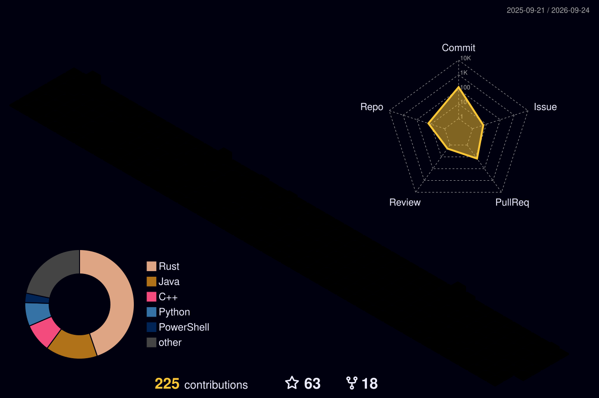

# Hi, I'm Sam Jiang 姜胤 👋

### Student Founder · Full-Stack Builder · Product Architect

*Building thoughtful products where technology, communities, and real-world impact meet.*

## About Me

I am a student at **Moonshot Academy** and a founder who turns ideas into products—from product architecture and full-stack engineering to delivery and community growth.

- **CEO, Hangzhou Huizhi Zhuochuang Technology Co., Ltd.（杭州汇智卓创科技有限公司）** — building for the rhythm game industry and operating UGC communities.
- **CEO, Tianjin Jinghai Huizhi Zhuochuang Culture Development Co., Ltd.（天津静海汇智卓创文化发展有限公司）** — creating smart-education solutions, campus products, and digital experiences for education.
- **Builder at heart** — working across product strategy, system design, engineering, and real-world execution.
- **Open to collaboration** — always interested in thoughtful product partnerships, business opportunities, and ambitious ideas.

## Teams & Communities

<table>
  <tr>
    <td align="center" width="33%">
      <a href="https://github.com/SmartTeachCN">
         
        <strong>SmartTeachCN</strong>
      </a>
    </td>
    <td align="center" width="33%">
      <a href="https://github.com/Project-Fukakai">
         
        <strong>Project Fukakai</strong>
      </a>
    </td>
    <td align="center" width="33%">
      <a href="https://github.com/ClassIsland">
         
        <strong>ClassIsland</strong>
      </a>
    </td>
  </tr>
</table>

## Technology Stack

<table>
  <tr>
    <td align="center" width="33%">
       
      <strong>Node.js</strong>
    </td>
    <td align="center" width="33%">
       
      <strong>Next.js</strong>
    </td>
    <td align="center" width="33%">
       
      <strong>Vue.js</strong>
    </td>
  </tr>
  <tr>
    <td align="center" width="33%">
       
      <strong>Rust</strong>
    </td>
    <td align="center" width="33%">
       
      <strong>Python</strong>
    </td>
    <td align="center" width="33%">
       
      <strong>Swift</strong>
    </td>
  </tr>
  <tr>
    <td align="center" width="33%">
       
      <strong>.NET</strong>
    </td>
    <td align="center" width="33%">
       
      <strong>Java</strong>
    </td>
    <td align="center" width="33%">
       
      <strong>SQL</strong>
    </td>
  </tr>
</table>

## GitHub Activity

  <a href="https://github.com/vn7n24fzkq/github-profile-summary-cards">
    <picture>
      <source media="(prefers-color-scheme: dark)" srcset="https://github-profile-summary-cards.vercel.app/api/cards/stats?username=jiangyin14&amp;theme=tokyonight">
      <source media="(prefers-color-scheme: light)" srcset="https://github-profile-summary-cards.vercel.app/api/cards/stats?username=jiangyin14&amp;theme=github">
      
    </picture>
  </a>
  <a href="https://github.com/vn7n24fzkq/github-profile-summary-cards">
    <picture>
      <source media="(prefers-color-scheme: dark)" srcset="https://github-profile-summary-cards.vercel.app/api/cards/repos-per-language?username=jiangyin14&amp;theme=tokyonight">
      <source media="(prefers-color-scheme: light)" srcset="https://github-profile-summary-cards.vercel.app/api/cards/repos-per-language?username=jiangyin14&amp;theme=github">
      
    </picture>
  </a>

  <a href="https://github.com/DenverCoder1/github-readme-streak-stats">
    <picture>
      <source media="(prefers-color-scheme: dark)" srcset="https://streak-stats.demolab.com?user=jiangyin14&amp;theme=tokyonight&amp;hide_border=true&amp;background=00000000">
      <source media="(prefers-color-scheme: light)" srcset="https://streak-stats.demolab.com?user=jiangyin14&amp;hide_border=true&amp;background=00000000&amp;ring=7C3AED&amp;fire=00D9FF&amp;currStreakLabel=7C3AED">
      
    </picture>
  </a>

## 3D Contribution Journey

  

## Let's Connect

Have an idea worth building? I'm open to product partnerships, business collaboration, and conversations with people creating meaningful things. For free to mail me at jiangyin14@smart-teach.cn anytime.

  
  

*Stay curious. Build boldly. Keep moving forward.*

